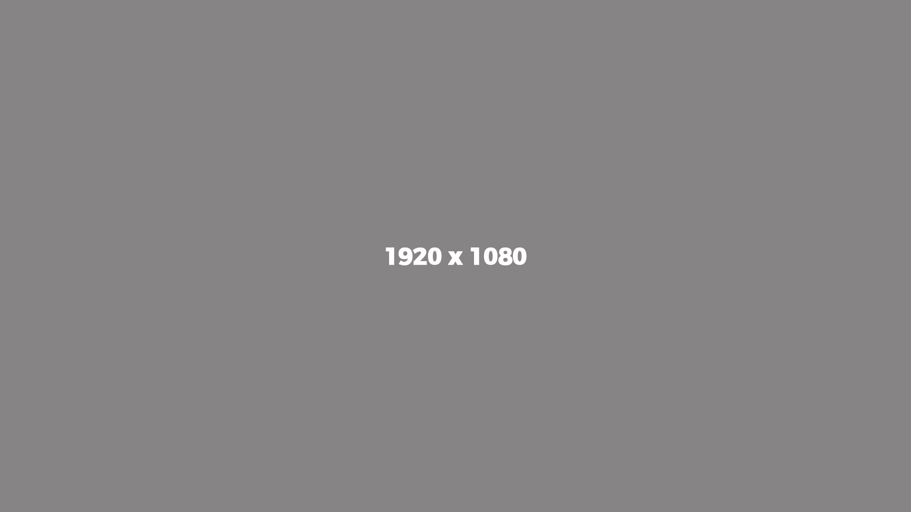

# Portfolio Website

A modern, responsive portfolio website showcasing projects, skills, and experience. Built with HTML5, CSS3, JavaScript, and jQuery.



## Features

- **Responsive Design**: Fully responsive layout that works on all devices
- **Modern UI/UX**: Clean, professional design with smooth animations
- **Portfolio Showcase**: Interactive project gallery with filtering
- **Contact Form**: Functional contact form with validation
- **Performance Optimized**: Fast loading times and optimized assets
- **Accessibility**: WCAG compliant with proper semantic HTML

## Project Structure

```
portfolio/
├── index.html              # Main entry point
├── css/
│   ├── style.css          # Main stylesheet
│   ├── plugins.css        # Third-party plugin styles
│   └── modal.css          # Modal dialog styles
├── js/
│   ├── init.js            # Page initialization
│   ├── contact_me.js      # Contact form handling
│   ├── portfolioFilter.js # Portfolio filtering logic
│   ├── jquery.js          # jQuery library
│   └── plugins.js         # Third-party plugins
├── img/                   # All images and assets
├── archive/               # Archived PHP mail handler
│   └── phpmail_backup/
│       ├── mail_handler.php
│       ├── email_config.default.php
│       └── phpmailer/     # PHPMailer library
├── .github/               # GitHub configuration
│   └── copilot-instructions.md
└── .vscode/               # VS Code configuration (gitignored)
```

## Technologies Used

- **HTML5**: Semantic markup
- **CSS3**: Flexbox, Grid, animations, media queries
- **JavaScript**: Vanilla JS and jQuery
- **jQuery Plugins**: 
  - jqBootstrapValidation (form validation)
  - Various UI components
- **PHPMailer**: Email sending functionality (archived)
- **Netlify Forms**: Alternative contact form handling

## Getting Started

### Local Development

1. **Clone the repository**
   ```bash
   git clone https://github.com/yourusername/portfolio.git
   cd portfolio
   ```

2. **Run a local server**
   ```bash
   # Using Python
   python3 -m http.server 8080
   
   # Or using PHP (for testing PHP mail handler)
   cd archive/phpmail_backup && php -S localhost:8000
   ```

3. **Open in browser**
   Navigate to `http://localhost:8080`

### Contact Form Setup

The portfolio includes two contact form options:

#### Option 1: Netlify Forms (Recommended for static hosting)
1. Add `data-netlify="true"` to the form in `index.html`
2. Add a hidden input: `<input type="hidden" name="form-name" value="contact">`
3. Deploy to Netlify - forms will work automatically

#### Option 2: PHP Mail Handler (Archived)
1. Copy `archive/phpmail_backup/email_config.default.php` to `email_config.php`
2. Update SMTP credentials in `email_config.php`
3. Ensure PHP server is running

**⚠️ Security Note**: Never commit real credentials. The `email_config.php` file is gitignored.

## Deployment

### Netlify (Recommended)
1. Push to GitHub
2. Connect repository to Netlify
3. Enable Netlify Forms for contact functionality
4. Deploy automatically on push

### GitHub Pages
1. Enable GitHub Pages in repository settings
2. Set source to `main` branch
3. Use Netlify Forms or a third-party form service

### Traditional Hosting
1. Upload all files to web server
2. Ensure PHP support if using PHP mail handler
3. Configure SMTP settings in `email_config.php`

## Customization

### Styling
- Modify `css/style.css` for colors, fonts, and layout
- Update `css/modal.css` for modal dialog styles
- Replace images in `img/` directory

### Content
- Edit `index.html` for page structure and content
- Update portfolio items in the portfolio section
- Modify contact form fields in `js/contact_me.js`

### JavaScript
- Edit `js/init.js` for page initialization
- Modify `js/portfolioFilter.js` for portfolio filtering logic
- Update `js/contact_me.js` for form behavior

## Security Considerations

This repository has been secured for public sharing:

- ✅ **API Keys Removed**: All hardcoded API keys replaced with placeholders
- ✅ **Sensitive Files Gitignored**: `.env`, `email_config.php`, `.vscode/` excluded
- ✅ **Comprehensive `.gitignore`**: Includes patterns for OS files, IDE files, dependencies
- ✅ **Placeholder Credentials**: Sample credentials replaced with `YOUR_*` placeholders

**Files modified for security:**
- `archive/phpmail_backup/phpmailer/PHPMailer/get_oauth_token.php` - OAuth credentials replaced
- `.vscode/mcp.json` - API key replaced with placeholder
- `.gitignore` - Updated with comprehensive exclusion patterns

## Browser Support

- Chrome (latest)
- Firefox (latest)
- Safari (latest)
- Edge (latest)
- Mobile browsers (iOS Safari, Chrome for Android)

## Performance

- Optimized images in `img/` directory
- Minified CSS and JavaScript where applicable
- Lazy loading for images
- Efficient CSS animations

## License

This project is available for personal and commercial use. Attribution is appreciated but not required.

## Acknowledgments

- Design inspired by modern portfolio templates
- Icons from various SVG sources
- PHPMailer for email functionality
- jQuery and Bootstrap for UI components

## Contact

For questions or feedback, please use the contact form on the website or open an issue in this repository.

---

**Last Updated**: April 2026
**Version**: 1.0.0
